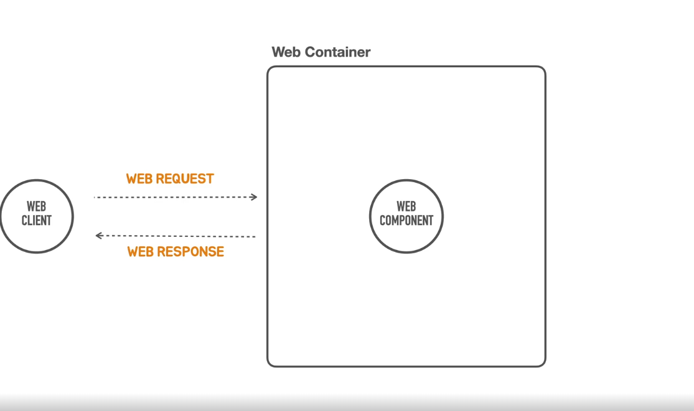
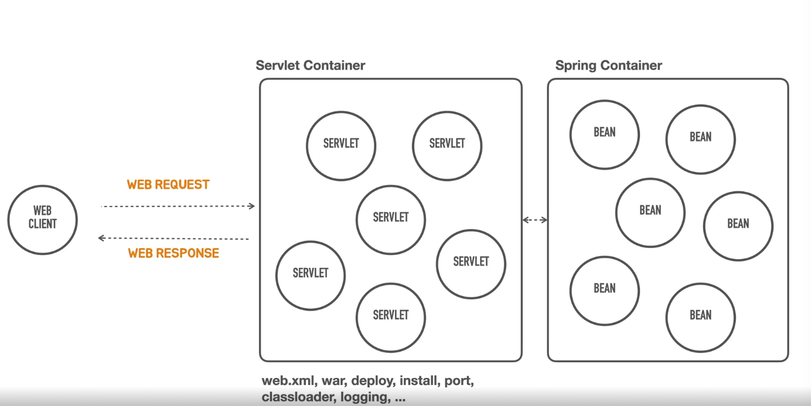
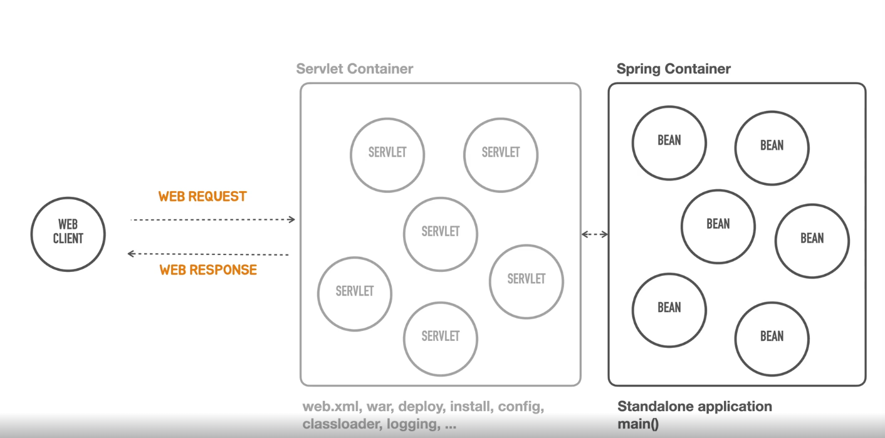

#Containerless
- webComponent는 어떤 무언가를 수행하는 하나의 단위라고 본다. 
- 이 webComponent는 혼자서 작동하지 않는다.  앞에 항상 webClient가 필요 하다.
- 아래 이미지처럼 webClient가 요청을 주어야지만 webComponent가 일을 할 수 있다. 요청이 오면 응답을 주게 되어있다.
- 이런 WebComponent는 WebContainer 안에 들어가 있어야 한다. 

- WebContainer 하는일 
- - webcomponent를 메모리에 올리거나 인스턴스를 생서해주느 이런 라이프 사이클을 관리하는 일으 한다.
- - 이런 여러개의 webComponent들이 존재한다. (예를들면 로그인 기능, 조회 기능, 수정 기능 등등..)
- - client가 보낸 요청을 어느 webComponent와 연결해줘야 하는지 결정하는 역할을 한다.  이런 작업을 라우팅 또는 맵핑이라고 얘기를 한다.
- - java에서는 이런 webComponent를 servlet이라누 불린다.
- - 이런 servlet를 관리해주는 컨테이너가 servlet 컨테이너 이다. 

##Spring Container
- Spring Container는 Servlet 뒤에서 존재하게 된다. 
- Servlet이 요청을 받으면 Spring Container에게 전달하게 된다. 
- Spring Container는 그렇게 전달 받은 요청을 특정 Bean에게 다시 전달해서 작업을 수행하게 한다. 

>>그렇다면 Spring Container가 Servlet을 대체 하면 되는것이 아닌가?
>>하지만 그렇지 않다. 자바 웹 표준 기술을 사용하려면은 Servlet을 사용해야 한다고 한다.

##Servlet Container의 단점 
- 서블릿컨테이너는 복잡한 설정들을 많이 해야한다.
- 폴더 구로를 맞춰야 하며(예를 들면 WEB-INF 이런것들)
- WAR 파일로 만들고 그 파일을 Tomcat 같은 것들 설치하고 거기에 war를 올려서 실행시켜야 한다. 
- 배포하면서 필요한 설정들 또는 그로인한 오류들도 다 알아야한다. 
- 서블릿 컨테이너는 거의 제품화된것을 사용한다 흔히 사용하는것이 Tomcat이다. 만약 각기 다른 제품을 사용해야 한다면 각각의 제품마다의 서플릿 컨테이너를 알아야 한다.
>> 이렇게 개발과 별도로 다른 것에 대해 공부를 해야 하며 시간들 들이는 것은 비효율 적이니 이런 수고들을 없이 개발할 수 있으면 좋겠다는 생각에 나온 개념이 Containerless다.  

아래 이미지와 같이 Servlet Container는 실제로 동작하지만 동작안하는것처럼 Servlet Contianer에 관련된 
설정 및 운영은 Spring이 관리해준다. 물론 깊게 공부하면은 이 부분도 커스터마이징을 할 수 있다. 
